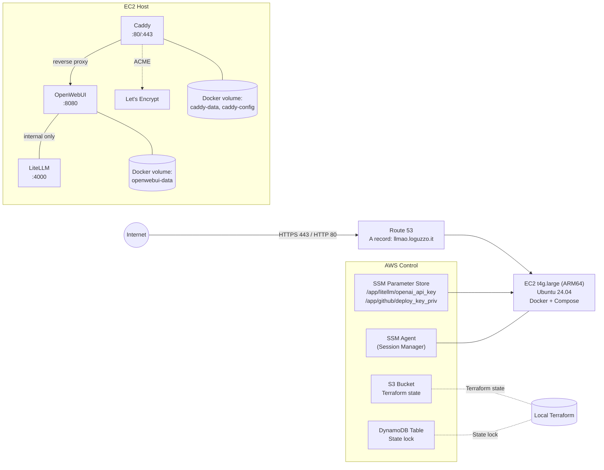

# llmao-aws — OpenWebUI + LiteLLM on a single ARM64 EC2 with Docker Compose

Public, reproducible deployment of OpenWebUI (web UI) fronted by Caddy (automatic HTTPS) with LiteLLM as an internal proxy to OpenAI. Provisioned via Terraform. Minimal, low-cost, and fully scripted.

- Region: eu-central-1
- Domain: llmao.loguzzo.it
- TLS/ACME email: info@loguzzo.it
- Instance: t4g.large (AWS Graviton, ARM64)
- Access: SSM Session Manager (no SSH)
- Persistence: Docker volumes on root EBS
- Secrets: AWS SSM Parameter Store (SecureString)
- Remote TF state: S3 + DynamoDB lock

## Architecture



## What you get

- HTTPS at https://llmao.loguzzo.it with automatic TLS (Caddy + Let’s Encrypt)
- OpenWebUI publicly accessible; authentication managed within OpenWebUI
- LiteLLM internal-only (not exposed to the internet), using OpenAI via OPENAI_API_KEY
- Single EC2 instance, scripted bootstrap (cloud-init): installs Docker/Compose, pulls repo via SSH deploy key, fetches secrets from SSM, and starts the stack
- Route 53 A record created automatically
- No SSH; management via AWS SSM

## Costs (approx, eu-central-1)

- EC2 t4g.large: ~€50–€60/month
- EBS gp3 40 GB: ~€3–€5/month
- Route 53: hosted zone already exists; one additional A record
- No ALB/NAT to keep costs low

## Prerequisites

- AWS account with permissions to create EC2, IAM roles, SSM parameters, Route 53 records
- Hosted zone for loguzzo.it in Route 53
- Terraform 1.13+ and AWS CLI v2 available locally
- GitHub repo: git@github.com:aloguzzo/llmao-aws.git (private is supported)

## Repository structure

- terraform/
  - backend.tf (S3 + DynamoDB remote state)
  - variables.tf (region, instance type, subdomain, email, repo URL)
  - main.tf (EC2, IAM, SG, Route 53, user_data)
  - user_data/bootstrap.sh.tpl (cloud-init)
  - outputs.tf
  - versions.tf
- compose/compose.yml (Docker Compose services)
- caddy/Caddyfile (reverse proxy to OpenWebUI)
- scripts/redeploy.sh (pull latest + recreate containers)

## One-time setup

1. Create/verify remote Terraform state (S3 + DynamoDB)

macOS (zsh)
```zsh
aws configure set default.region eu-central-1

# S3 bucket (matches terraform/backend.tf)
aws s3api head-bucket --bucket tfstate-llm-aws-prod-h330zsikdc || \
aws s3api create-bucket --bucket tfstate-llm-aws-prod-h330zsikdc --region eu-central-1 --create-bucket-configuration LocationConstraint=eu-central-1

aws s3api put-bucket-versioning --bucket tfstate-llm-aws-prod-h330zsikdc --versioning-configuration Status=Enabled
aws s3api put-public-access-block --bucket tfstate-llm-aws-prod-h330zsikdc --public-access-block-configuration BlockPublicAcls=true,IgnorePublicAcls=true,BlockPublicPolicy=true,RestrictPublicBuckets=true

# DynamoDB lock table
aws dynamodb describe-table --table-name tfstate-lock-llm-aws-prod >/dev/null 2>&1 || \
aws dynamodb create-table \
  --table-name tfstate-lock-llm-aws-prod \
  --attribute-definitions AttributeName=LockID,AttributeType=S \
  --key-schema AttributeName=LockID,KeyType=HASH \
  --billing-mode PAY_PER_REQUEST \
  --region eu-central-1
```

Windows (PowerShell 7)
```powershell
aws configure set default.region eu-central-1

# S3 bucket
aws s3api head-bucket --bucket tfstate-llm-aws-prod-h330zsikdc 2>$null
if ($LASTEXITCODE -ne 0) {
  aws s3api create-bucket --bucket tfstate-llm-aws-prod-h330zsikdc --region eu-central-1 --create-bucket-configuration LocationConstraint=eu-central-1
}
aws s3api put-bucket-versioning --bucket tfstate-llm-aws-prod-h330zsikdc --versioning-configuration Status=Enabled
aws s3api put-public-access-block --bucket tfstate-llm-aws-prod-h330zsikdc --public-access-block-configuration BlockPublicAcls=true,IgnorePublicAcls=true,BlockPublicPolicy=true,RestrictPublicBuckets=true

# DynamoDB
aws dynamodb describe-table --table-name tfstate-lock-llm-aws-prod 2>$null
if ($LASTEXITCODE -ne 0) {
  aws dynamodb create-table `
    --table-name tfstate-lock-llm-aws-prod `
    --attribute-definitions AttributeName=LockID,AttributeType=S `
    --key-schema AttributeName=LockID,KeyType=HASH `
    --billing-mode PAY_PER_REQUEST `
    --region eu-central-1
}
```

1. Prepare secrets in AWS SSM Parameter Store (eu-central-1)

- GitHub Deploy Key (private key) for the repo (read-only), previously added in GitHub under Repo Settings → Deploy Keys.
- OpenAI API key for LiteLLM.

macOS (zsh)
```zsh
aws ssm put-parameter \
  --name "/app/github/deploy_key_priv" \
  --type "SecureString" \
  --value "$(cat ./llm-deploy)" \
  --overwrite \
  --region eu-central-1

aws ssm put-parameter \
  --name "/app/litellm/openai_api_key" \
  --type "SecureString" \
  --value "sk-REPLACE_ME" \
  --overwrite \
  --region eu-central-1
```

Windows (PowerShell 7)
```powershell
aws ssm put-parameter `
  --name "/app/github/deploy_key_priv" `
  --type "SecureString" `
  --value "$(Get-Content .\llm-deploy -Raw)" `
  --overwrite `
  --region eu-central-1

aws ssm put-parameter `
  --name "/app/litellm/openai_api_key" `
  --type "SecureString" `
  --value "sk-REPLACE_ME" `
  --overwrite `
  --region eu-central-1
```

Notes:
- IAM instance role is limited to read /app/* parameters and KMS decrypt.
- The deploy key is never committed to Git; it’s retrieved at boot.

## Deploy

macOS (zsh)
```zsh
cd terraform
terraform init -reconfigure
terraform apply \
  -var 'github_repo_url=git@github.com:aloguzzo/llmao-aws.git' \
  -var 'acme_email=info@loguzzo.it' \
  -var 'subdomain=llmao'
```

Windows (PowerShell 7)
```powershell
cd terraform
terraform init -reconfigure
terraform apply `
  -var 'github_repo_url=git@github.com:aloguzzo/llmao-aws.git' `
  -var 'acme_email=info@loguzzo.it' `
  -var 'subdomain=llmao'
```

What happens:
- EC2 instance (Ubuntu 24.04 ARM64) is created with public IP
- Security Group opens 80/443 only
- IAM Role enables SSM and Parameter Store read
- Route 53 A record llmao.loguzzo.it -> instance public IP
- On boot, cloud-init:
  - Installs AWS CLI, SSM Agent, Docker + Compose
  - Configures SSH, pulls repo via deploy key
  - Creates compose/.env with CADDY_DOMAIN=llmao.loguzzo.it and ACME_EMAIL
  - Fetches OPENAI_API_KEY from SSM
  - docker compose up -d

## Verify

- DNS:
```sh
terraform -chdir=terraform output -raw public_ip
dig +short llmao.loguzzo.it
```

- Open https://llmao.loguzzo.it — first load triggers TLS issuance by Caddy.

- In OpenWebUI:
  - Create admin user and enforce authentication
  - Set API Base URL to http://litellm:4000 (OpenAI-compatible via LiteLLM)

## Operate (SSM-only)

Start a shell session:

macOS (zsh)
```zsh
aws ssm start-session --target "$(terraform -chdir=terraform output -raw instance_id)" --region eu-central-1
```

Windows (PowerShell 7)
```powershell
$iid = terraform -chdir=terraform output -raw instance_id
aws ssm start-session --target $iid --region eu-central-1
```

Common commands (inside session):
```sh
docker ps
docker logs --tail 100 caddy
docker logs --tail 100 openwebui
docker logs --tail 100 litellm
```

Redeploy after pushing changes to GitHub:

macOS (zsh)
```zsh
aws ssm send-command \
  --document-name "AWS-RunShellScript" \
  --targets "Key=instanceids,Values=$(terraform -chdir=terraform output -raw instance_id)" \
  --parameters commands=["bash /opt/app/scripts/redeploy.sh"] \
  --region eu-central-1
```

Windows (PowerShell 7)
```powershell
$iid = terraform -chdir=terraform output -raw instance_id
aws ssm send-command `
  --document-name "AWS-RunShellScript" `
  --targets "Key=instanceids,Values=$iid" `
  --parameters commands=["bash /opt/app/scripts/redeploy.sh"] `
  --region eu-central-1
```

Rotate OpenAI key:
```sh
aws ssm put-parameter --name "/app/litellm/openai_api_key" --type "SecureString" --value "sk-NEW" --overwrite --region eu-central-1
# Then redeploy as above, or restart just LiteLLM via SSM session:
# docker restart litellm
```

## Security notes

- No SSH exposed; use SSM Session Manager
- Security Group allows inbound 80/443 only
- Let’s Encrypt certificates managed automatically by Caddy
- Secrets stored in SSM Parameter Store (encrypted), not in git or Terraform state

## Troubleshooting

- Private repo clone fails:
  - Ensure SSM parameter /app/github/deploy_key_priv exists and matches your private key content exactly
  - From an SSM session:
    - sudo -u ubuntu -i
    - ssh -T git@github.com (should confirm auth)
  - Confirm github_repo_url is SSH format: git@github.com:aloguzzo/llmao-aws.git

- TLS not issued:
  - Check A record llmao.loguzzo.it resolves to instance IP
  - Ensure ports 80/443 are reachable (SG configured)
  - docker logs caddy to view ACME challenges/errors

- LiteLLM not reachable from OpenWebUI:
  - In OpenWebUI settings, ensure API Base URL is http://litellm:4000
  - docker logs litellm for startup or provider errors

- Default VPC missing:
  - If Terraform fails on data.aws_vpc.default, provision a small VPC or adapt main.tf to use your VPC/subnets

## Roadmap (optional enhancements)

- CloudWatch logs via awslogs driver or CloudWatch Agent
- EBS snapshot backups (AWS Backup)
- Pin container image versions and add CI to rebuild periodically
- WAF in front of Caddy if you need filtering/throttling
- Migrate to ALB + ECS or EKS if scaling beyond a single instance

## License

MIT (or your preferred license).